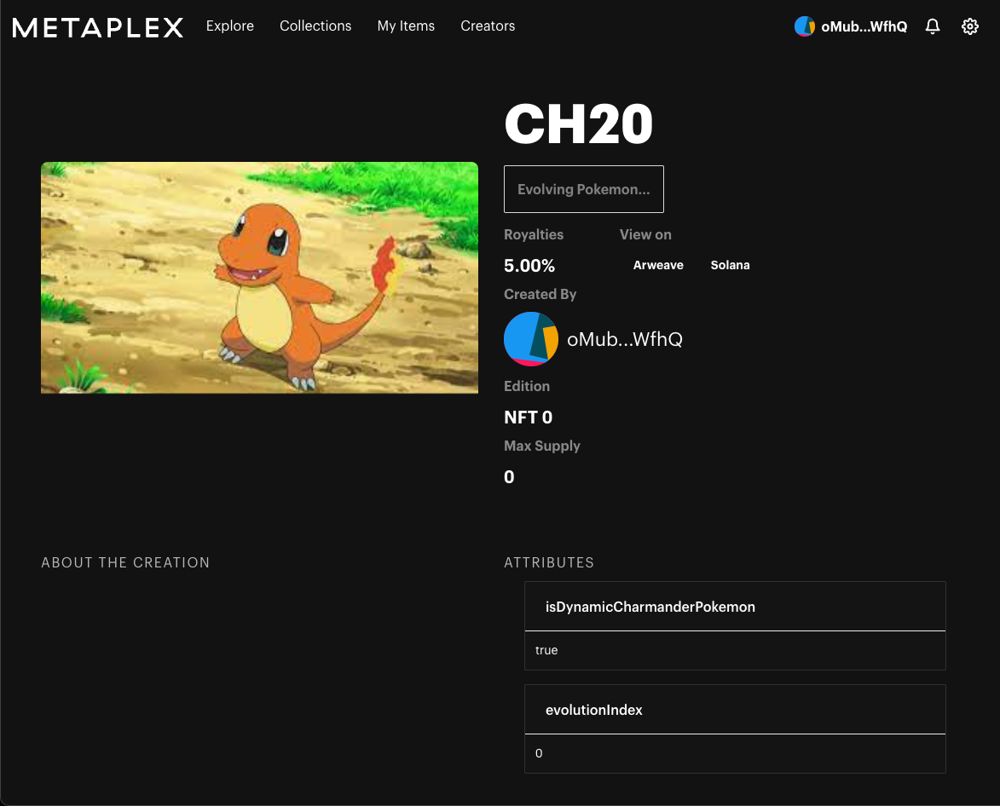
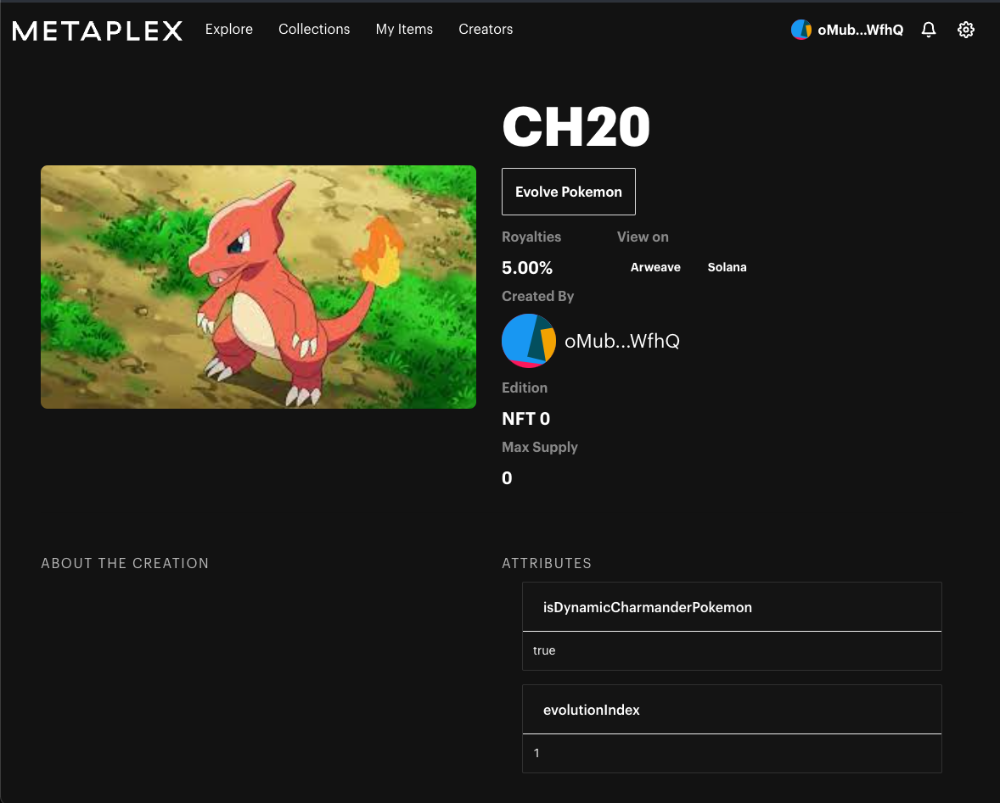

# Week 4: NFTs

This week was all about NFTs - what they are, when can they be used and how to create some on Solana.

## Creator ecosystem

We had a session by [Jenil](https://twitter.com/0xjenil) from [Coinvise](https://www.coinvise.co/) at the start of the
week. He talked about communities, NFTs, tokens, DAOs and web3 in general. It was an insightful session, with some
interesting anecdotes from his own journey. Jenil also talked about ideas and how to evaluate and build them,
specifically in web3. The way early projects and communities originate and operate is very different from web2
companies. It's something I need to think about in the coming weeks as the project deadline comes closer.

## NFTs

This week we did 2 quests -
[creating and burning NFTs using `@solana/web3.js`](https://openquest.xyz/quest/create-burn-nft-solana) and
[creating your own NFT minting machine](https://openquest.xyz/quest/create_a_candy_machine_minting_nft_and_minting_website_v2).
I particularly enjoyed the second one. It allowed me to deploy a nft minting machine quickly, and then I could peek
inside the code and see what was happening.

I had previous experience creating NFTs on Ethereum. The mental model on Solidity was much simpler. There were a couple
of interfaces - ERC-721 and ERC-1155 - implement those, go as crazy as you want with the implementation, and you are
done.

Metaplex is the de-facto NFT standard on Solana. It is significantly more complex than the Ethereum standards. Some of
it is because of Solana's programming model and some of it is to be fast. But the good thing is, Metaplex has excellent
tooling, documentation and UI code to get you started. That is what I leaned on to understand Solana NFTs and do the
exercise.

## Dynamic NFTs

This week's exercise was to create a NFT marketplace with support for dynamic NFTs. I decided to build dynamic Pokemon
NFTs. You start with Charmander Pokemon and can evolve it into Charmeleon, Charizard and so on.

I bootstrapped with [Metaplex Storefront](https://docs.metaplex.com/storefront/introduction) and added UI components to
create and evolve Pokemon NFTs. The creator could go to the Pokemon NFT page and click on a button to evolve it. The
most challenging part was learning about the Metaplex APIs and the Metaplex Storefront UI cache management.

*Evolving...*

*Evolved!*

This was not the best solution though. Right now, the dynamic nature involves updating of the metadata by the creator
manually - clicking a button. Ideally, there should have an on-chain program as the update authority of the NFT and that
program would be responsible for checking the conditions for evolution and/or evolving the NFT automatically based on
conditions like time passed etc. But I didn't have enough time to implement that unfortunately! It's a nice addon that I
may implement at some point.

---

Finally, I was able to build and deploy something that I could imagine being a real product. Feels exciting. Next week
is DeFi week and finalizing my project idea week.
