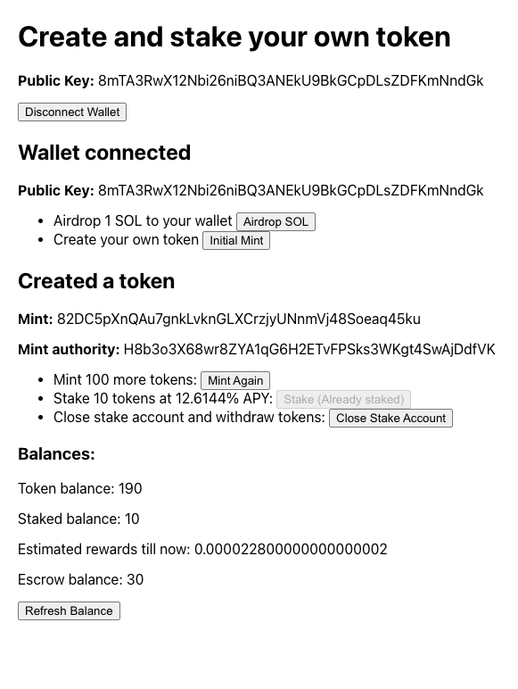

# Week 5: DeFi

This week was focused on DeFi - basics of tokens, staking, and tokenomics.

## DAO treasuries and getting into web3

This week we had a session by [Shreyas](https://twitter.com/HelloShreyas), who's the co-founder of
[Llama](https://llama.xyz/). He talked about economic infrastructure for DAO treasuries, how to create a community, his
journey in web3 and how important it is to have a good name for your product!

I connected a lot with his journey into web3 - he left his job wanting to get into a new industry, took part in
hackathons to force himself to do something - something I am trying to do. Another interesting thing he talked about was
how he decided what problems to work on - he used to help people with their DAOs and that's where he came across the
problem people face managing treasuries. Since then, he has built a product, created a community around it and built up
conviction in the problem statement.

## Creating my own wallet and cryptocurrency

To see how Defi is implemented on Solana, we did 3 quests -
[creating a wallet](https://openquest.xyz/quest/create_personal_wallet),
[creating your own crypto using solana programs](https://openquest.xyz/quest/solana-my-money) and
[creating your own crypto using javascript](https://openquest.xyz/quest/create_crypto_with_js). All of these were
focused on how to move money, SOL or any other SPL token.

The first 2 interacted with Solana through it's JSON RPC API but the last one was interesting - we had to create a
Solana contract that proxies calls to the main SPL token program. This ability to easily call other programs makes the
ecosystem so much more composable and rich.

## Staking and Tokenomics

The exercise for this week was to add support for staking to the cryptocurrency created in one of the quests. This is
what I ended up making.

*Staking program UI*

I had to think a lot about where to escrow the funds, how to make different escrow accounts for different tokens, and
to connect it all in the UI providing a good user experience. It was a fun exercise, and I ended up learning a lot.

Doing this exercise also made me think about token economics (tokenomics for short). Different projects have different
ways of token distribution, inflation, rewards, etc. I wanted to why different projects choose different mechanics and
how they implement those.

I read the documentation of [Solana economics](https://docs.solana.com/economics_overview). It is very interesting, well
written set of articles. I would suggest everyone to go through them if they want to know why people stake and why it's
good for the blockchain that people distribute their stake to different validators - which is a problem some projects
are trying to solve.

---

I only had time to go through Solana tokenomics this week. But I do plan to continue exploring this field. The theory
and math behind it is very interesting.

I have still not finalized my idea till now. That's mostly because of over-thinking and idea-paralysis. I'll focus on
that for the next couple of days amd hopefully start working on it as well early next week.
