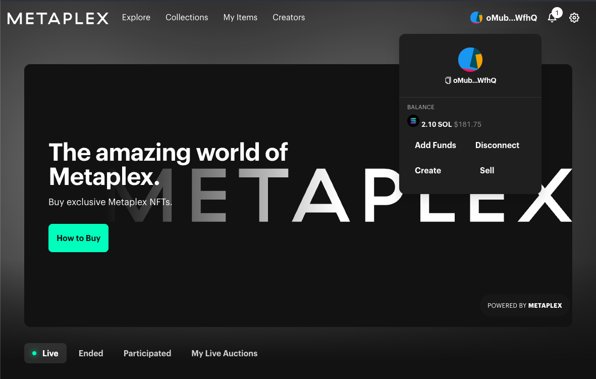
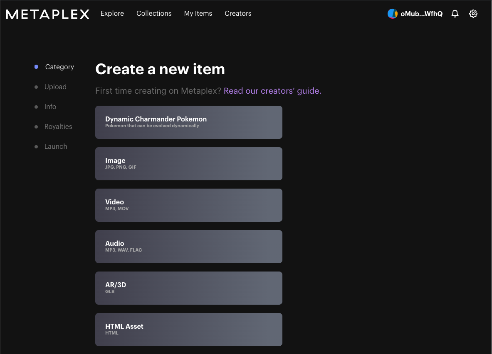
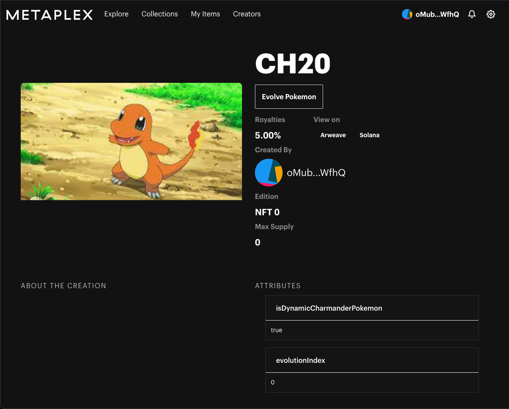
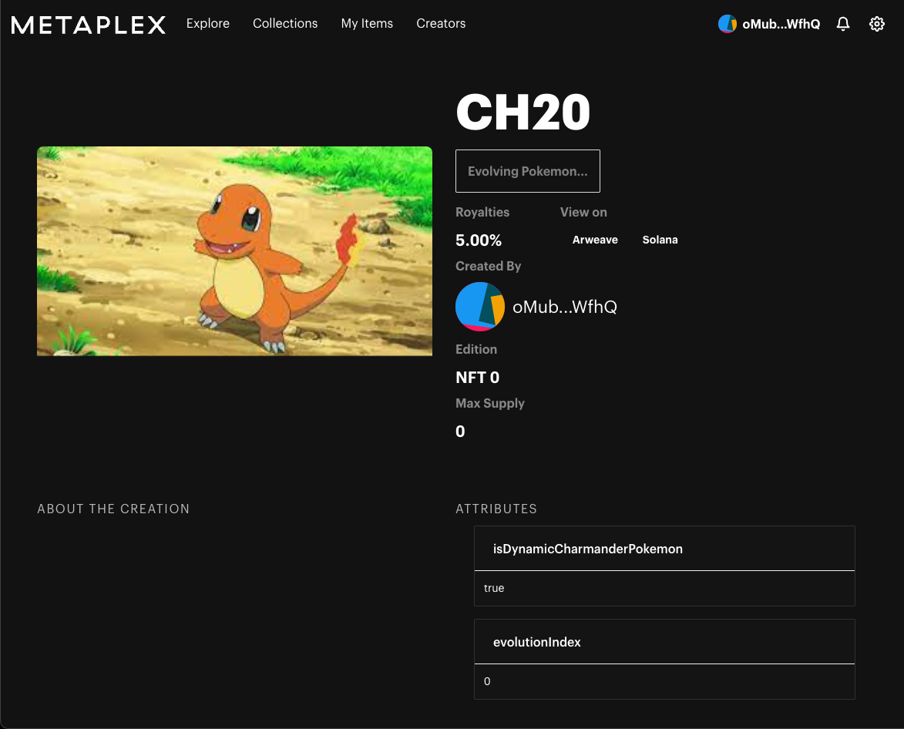
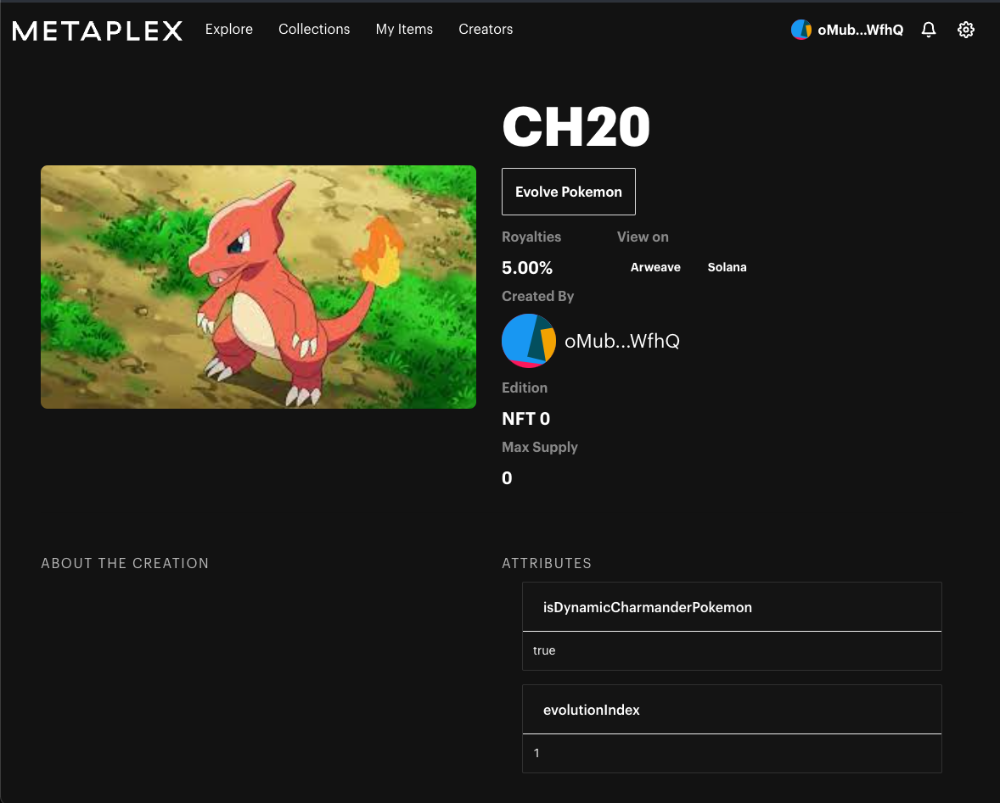

# NFT Marketplace

## Requirements

- [node.js](https://nodejs.org/en/download/) (>= 14.17.0)
- [yarn](https://yarnpkg.com/en/)

### Apple M1 Chip

If you have Mac OS with the Apple M1 Chip, you'll need to install some additional dependencies.

- [brew](https://brew.sh/)

After installing brew, run the following:

```shell
brew install pkg-config cairo pango libpng jpeg giflib librsvg
```

See additional information: https://github.com/Automattic/node-canvas/wiki/Installation%3A-Mac-OS-X

## Local setup

Install dependencies.

```shell
cd metaplex/js && yarn install && yarn bootstrap
```

Now, run the store web server locally.

```shell
yarn start
```

## Initialize store

Make sure you have a Phantom wallet. Change to the devnet and make sure you have some SOL in it.

Read this to initialize the store: https://docs.metaplex.com/storefront/init-store

This will take ~ 5 mins.

## Dynamic Pokemon NFTs

I used [Metaplex Storefront](https://docs.metaplex.com/storefront/introduction) as the NFT marketplace which already had
support for creating/selling NFTs.

I added support for dynamic Pokemon NFTs (only one Pokemon for now).

Here's how you can create/evolve them.

- Open create NFT page




- Create a dynamic NFT: Choose the first option on the create page and then follow the rest of the steps to create a
  dynamic Pokemon NFT. Note the extra attributes added in the NFT automatically. They represent the Pokemon state.


*Click the first option*


*Final NFT!*

- Evolve the Pokemon: There will be a `Evolve Pokemon` button on these dynamic NFTs. You can click on it to evolve the
  Pokemon and update the NFT. Wait for sometime for the page to refresh. Notice the attributes and the image change upon
  evolving.


*Evolving...*


*Evolved!*

## Notes on implementation

- Right now, the dynamic nature involves updating the metadata by the creator manually.

- Ideally, there we'd have an on-chain program as the update authority of the NFT and that would be responsible for
  checking the conditions for evolution and/or evolving the NFT automatically based on some conditions like time passed
  etc.
