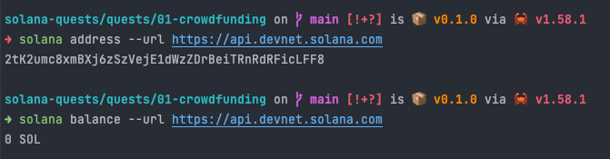
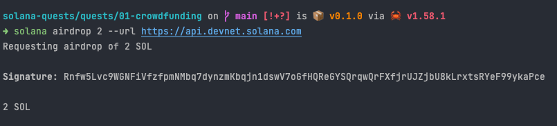
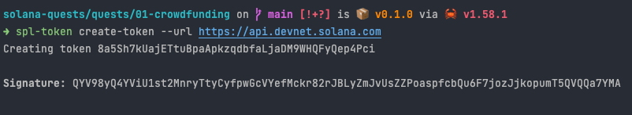
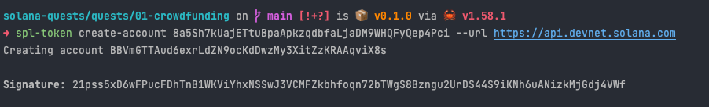
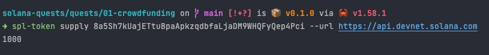
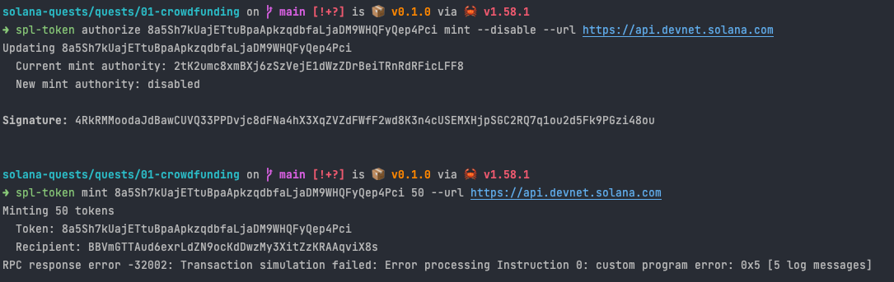
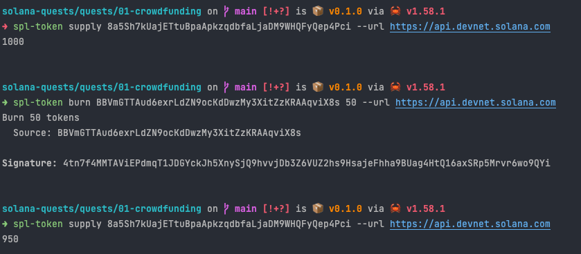
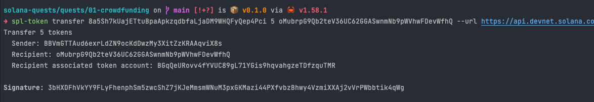
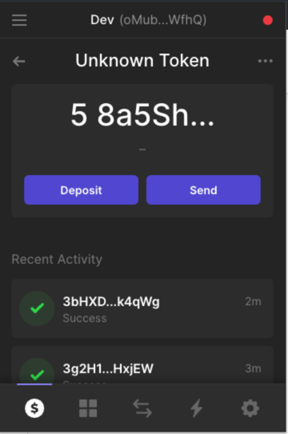

# Create cryptocurrency using Solana CLI

Currency on Solana explorer: https://explorer.solana.com/address/8a5Sh7kUajETtuBpaApkzqdbfaLjaDM9WHQFyQep4Pci?cluster=devnet

Token account holding tokens: https://explorer.solana.com/address/BBVmGTTAud6exrLdZN9ocKdDwzMy3XitZzKRAAqviX8s?cluster=devnet

## Steps to create the cryptocurrency

### Account on devnet used to create token

### Airdrop some SOL

### Create token

- Token address: 8a5Sh7kUajETtuBpaApkzqdbfaLjaDM9WHQFyQep4Pci
- Mint authority: 2tK2umc8xmBXj6zSzVejE1dWzZDrBeiTRnRdRFicLFF8

### Create token account

- Token account address: BBVmGTTAud6exrLdZN9ocKdDwzMy3XitZzKRAAqviX8s

### Mint 1000 tokens

### Check total token supply

### Disable token minting

### Burn tokens

### Transfer tokens

