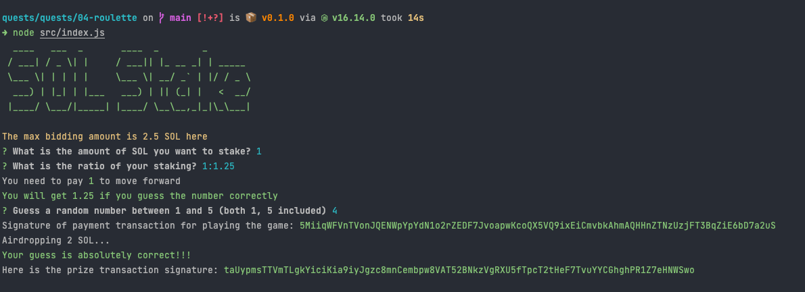
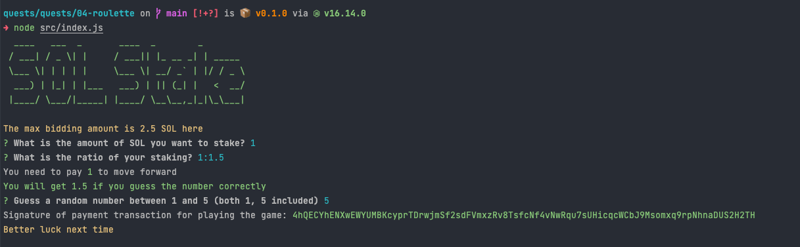
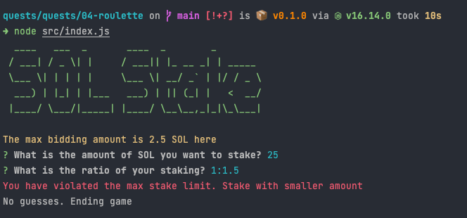

# Roulette Game

## Setup and create wallets for the treasury and user

```shell
npm install
node src/create_wallets.js
```

## Play Roulette game

```shell
node src/index.js
```

## Screenshots

### Winning game



### Losing game



### Invalid input game


