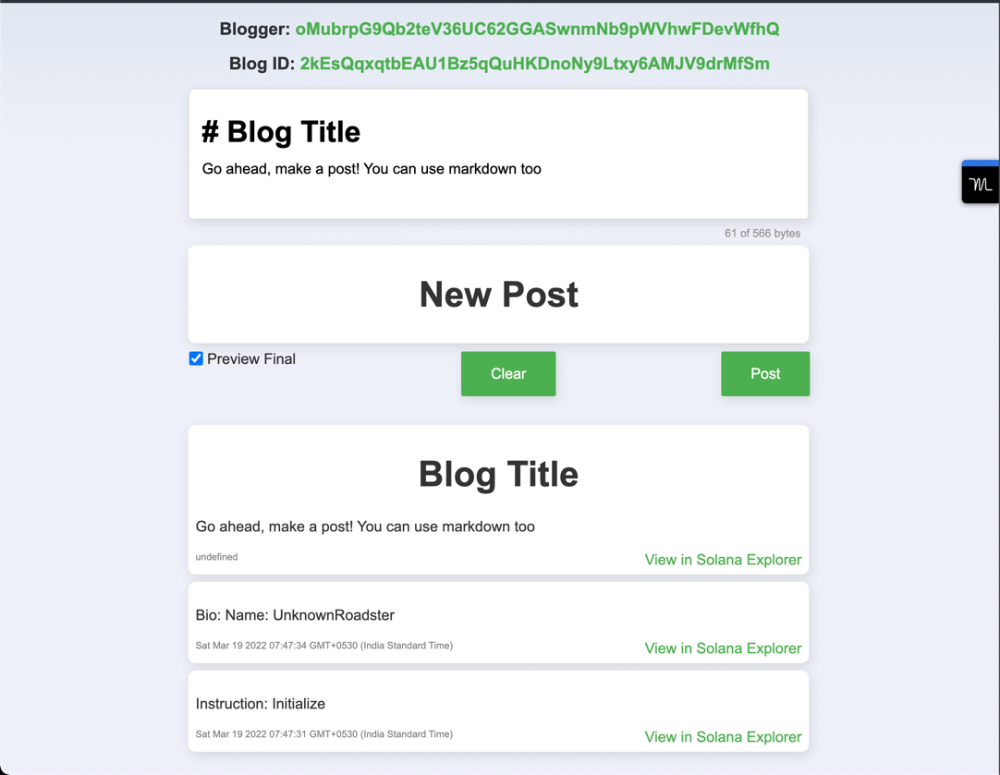

# Blog

## Running the app

- App is already deployed on Devnet:
[Solana Explorer Link](https://explorer.solana.com/address/HX1Gw4YywFxBFf136BMTMiSEkFPsfqi9MqKcVec5Kh99?cluster=devnet)

- Run the web app. The app works with Devnet program.
```shell
cd app
npm install
npm run dev3654
```

- Open the app at [http://localhost:3654/](http://localhost:3654/)

## Screenshot


