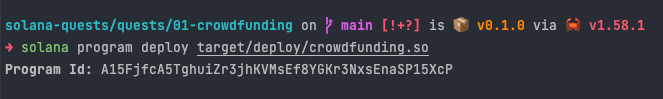

# Deploy crowdfunding program on Solana

## Build and test the program compiled for BPF

```shell
cargo build-bpf
cargo test-bpf
```

## Deploying on to Solana test validator

```shell
solana program deploy targets/deploy/crowdfunding.so
```


